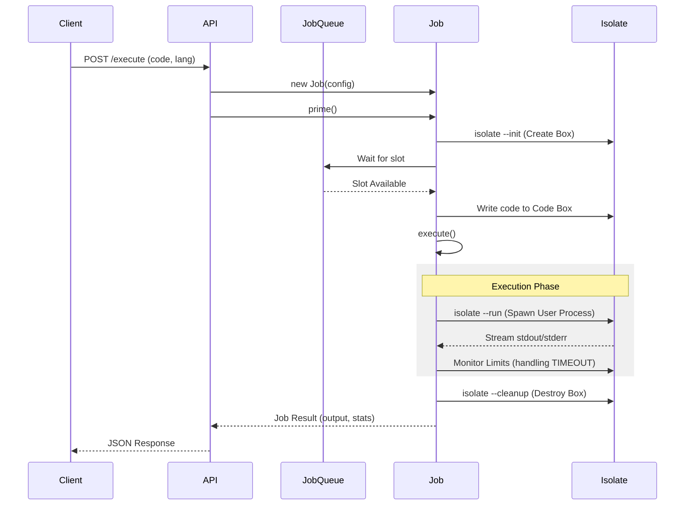

# Piston Architecture & Implementation Guide

> [!NOTE]
> This document is designed as an educational resource for engineering students to understand the internal workings of a high-performance code execution engine.

## 1. Project Overview

**Piston** is a high-performance, general-purpose code execution engine. It allows you to send source code in almost any language and receive the compilation output and execution result safely and quickly.

It is designed with two competing goals in mind:
1.  **Security**: Running untrusted code from strangers without destroying the host server.
2.  **Performance**: Executing that code with minimal overhead and latency.

The system is built primarily in **Node.js** (API) and leverages **Docker** and a specialized Linux sandbox tool called **Isolate**.

## 2. System Architecture

The Piston system can be visualized as a pipeline that takes raw code and transforms it into isolated processes.

```mermaid
graph TD
    User[User / Client] -->|HTTP POST /execute| API[Piston API Server]
    API -->|Validation| QM[Job Queue Manager]
    QM -->|Dispatch| Worker[Job Worker]
    
    subgraph "Execution Environment (Sandbox)"
        Worker -->|1. Init Box| Iso[Isolate Sandbox]
        Iso -->|2. Write Files| FS[Box File System]
        Iso -->|3. Spawn Process| Proc[User Process]
    end
    
    Proc -->|Stdout/Stderr| Worker
    Worker -->|JSON Response| User
    
    subgraph "Package System"
        PPM[ppman (Package Manager)] -->|Fetch| Repo[Remote Repository]
        PPM -->|Install| Store[Local Package Store]
        Store -.->|Mount/Link| Iso
    end
```

### Core Components

1.  **API Server (`api/src/index.js`)**:
    *   The entry point for all requests.
    *   It is an Express.js application that handles routing, request validation (`api/src/api/v2.js`), and WebSocket connections for interactive execution.
    *   It initializes the runtime environment by ensuring data directories exist and loading installed packages.

2.  **Job Manager (`api/src/job.js`)**:
    *   The heart of the execution engine.
    *   Manages the lifecycle of a "Job" (a single code execution request).
    *   Handles the queueing of jobs to prevent server overload (`config.max_concurrent_jobs`).

3.  **Package Manager (`api/src/package.js`)**:
    *   Responsible for the supply chain.
    *   Downloads, validates (checksums), and installs new languages (Runtimes) from a remote repository.

4.  **Sandbox (`isolate`)**:
    *   An external binary tool used to create secure environments.
    *   It uses Linux namespaces, cgroups, and chroot to ensure the user's code cannot see or touch anything outside its designated "box".

---

## 3. Core Modules Deep Dive

### 3.1 The Execution Engine (`api/src/job.js`)

The `Job` class is responsible for the entire lifecycle of a user's code submission. This lifecycle has three main states: `READY`, `PRIMED`, and `EXECUTED`.

#### Phase 1: Priming (The Setup)
Before code can run, a secure "box" must be prepared. This is handled in the `prime()` method.
1.  **Concurrency Control**: It checks `remaining_job_spaces`. If the server is full, the job waits in a `job_queue`.
2.  **Box Initialization**: Calls `isolate --init` to create a new sandbox ID. This creates a directory (e.g., `/var/local/lib/isolate/0/box`) where the code will live.
3.  **File Injection**: The user's source code files are written into this box directory.

#### Phase 2: Execution via `safe_call`
This is where the magic happens. The `safe_call` method wraps the execution of the `isolate` binary. It constructs a complex command line that enforces all security, limits, and environment configurations.

**Key Arguments passed to `isolate`**:
*   `--box-id`: Which sandbox to use.
*   `--processes`: Max number of processes (prevent fork bombs).
*   `--wall-time` / `--time`: Max execution time (prevent infinite loops).
*   `--dir`: Mounts the language runtime (e.g., Python binary) into the box so the code can actually run.
*   `--share-net`: (Optional) Toggles network access.

**The "Compile Once, Run Many" Pattern (`execute_batch`)**:
For efficiency, specifically in competitive programming scenarios, Piston supports batch execution.
1.  **Compile**: The code is compiled *once*.
2.  **Snapshot**: The state after compilation (the binary) is preserved.
3.  **Loop**: The binary is executed multiple times against different inputs (`stdin`) without recompiling.
4.  **Verify**: Each output is compared against an expected output using a normalization function (ignoring trailing whitespace).

### 3.2 Package Management (`api/src/package.js`)

Piston is language-agnostic. It doesn't "know" Python or Java; it only knows "Packages".

**The Install Flow (`install()` method)**:
1.  **Download**: Fetches `pkg.tar.gz` from the configured repo.
2.  **Verify**: Calculates SHA256 checksum and compares it with the repo index. **Critical for security** to ensure no tampered binaries are installed.
3.  **Extract**: Untars the file into `packages/<lang>/<version>`.
4.  **Environment Check**: Runs a script to capture environment variables (like `JAVA_HOME` or `PYTHONPATH`) needed for that language and caches them in a `.env` file. This speeds up future runs by avoiding re-calculation.

---

## 4. Runtime Specification (The "Packages")

A "Runtime" in Piston is just a directory with a specific structure. This makes it incredibly easy to add new languages.

### Anatomy of a Package

Take **Python** as an example (`packages/python/3.10.0/`):

1.  **`metadata.json`**:
    ```json
    {
        "language": "python",
        "version": "3.10.0",
        "aliases": ["py", "python3"]
    }
    ```
    Tells Piston what this is and how users can request it.

2.  **`run`** (The Entrypoint):
    A simple shell script that tells Piston how to execute a file in this language.
    ```bash
    #!/bin/sh
    /usr/local/bin/python3 "$1"
    ```
    When Piston runs a job, it actually runs: `/bin/bash <package_dir>/run <user_file>`.

3.  **`build.sh`** (For Package Maintainers):
    The script used to build the interpreter from source. This ensures Piston uses clean, minimal, and controlled binaries, not just whatever is on the host OS.

---

## 5. Performance & Security Interactions

### 5.1 Security through Isolation
Piston assumes **all** user code is malicious.
*   **Linux Namespaces**: The process sees a fake root filesystem and process tree. It thinks it is PID 1 and the only thing running.
*   **Control Groups (cgroups)**: The kernel strictly limits the memory and CPU cycles the process can consume. If it tries to allocate 2GB of RAM when only 512MB is allowed, the kernel OOM-kills it instantly.
*   **UID/GID Switching**: Code runs as a low-privilege user, preventing access to system files even if it breaks out of the chroot (which is already hard).

### 5.2 Performance Optimizations
*   **Pre-warming (Job Priming)**: Jobs are "primed" (directories created) as soon as they are received, even before they reach the head of the execution queue.
*   **Environment Caching**: As mentioned in Package Management, environment variables are calculated once at install time, not every run.
*   **Tmpfs Mounting**: Isolate can mount directories as `tmpfs` (RAM disks), making file I/O operations from user code extremely fast and saving disk wear.

---

## 6. Diagram Reference: Request Lifecycle


